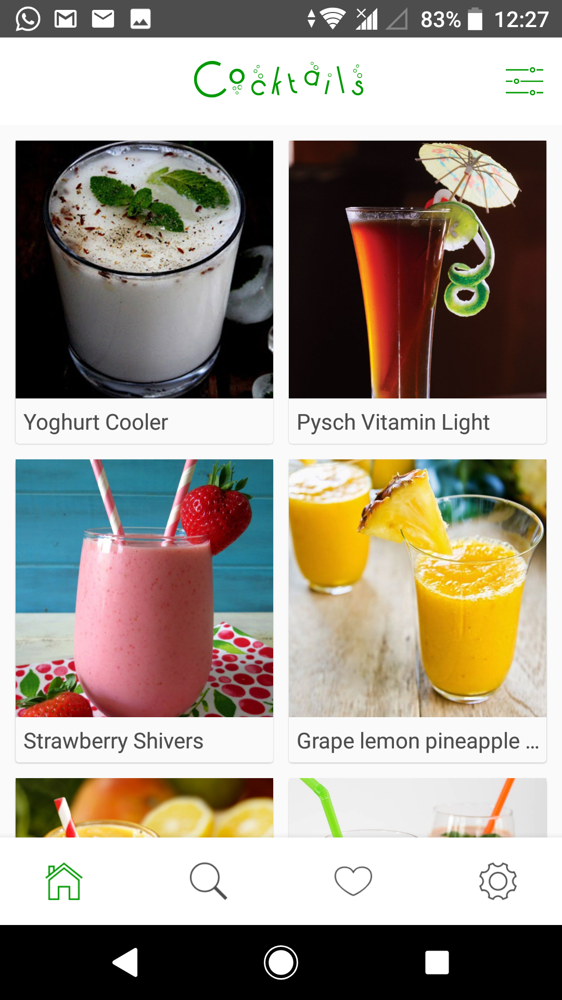
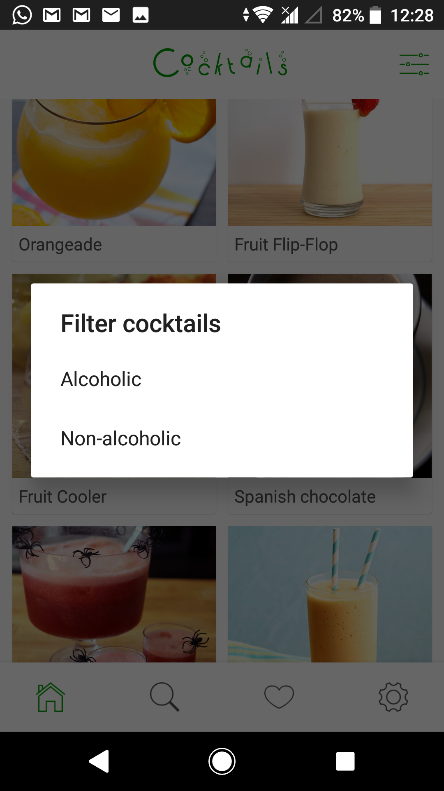
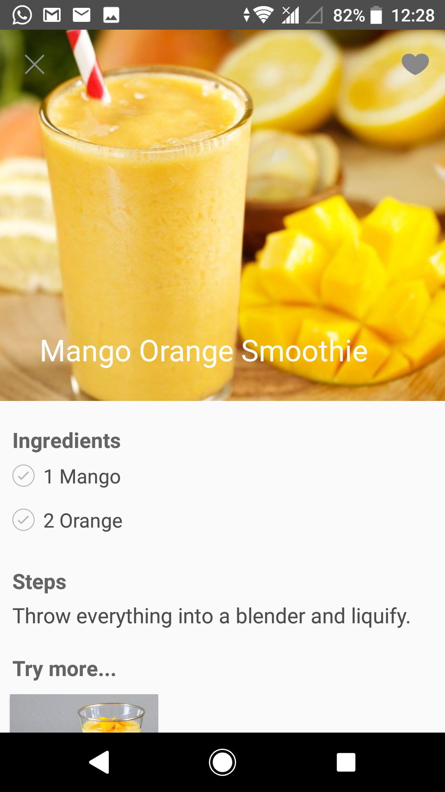
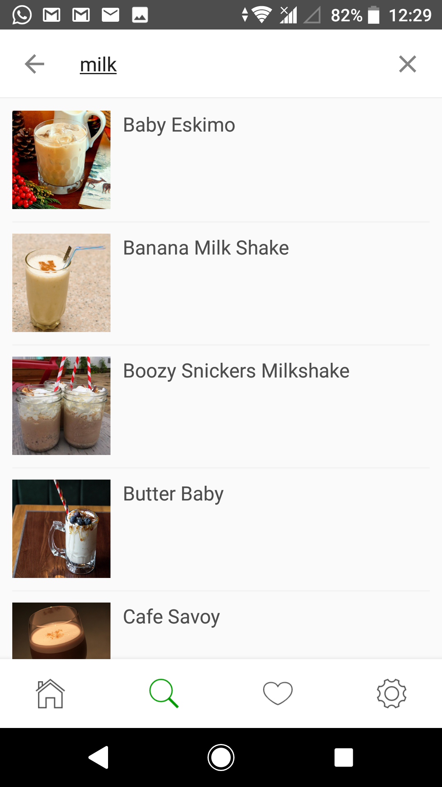
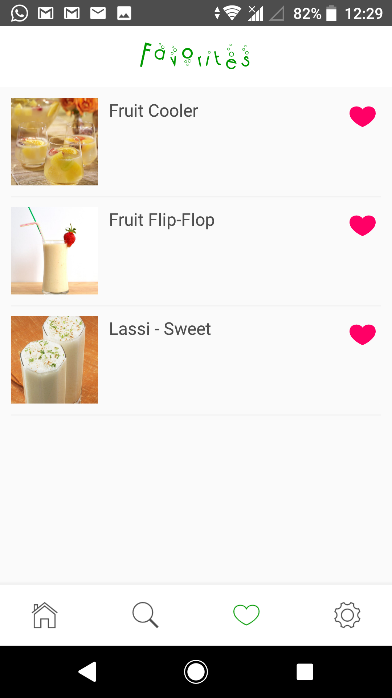

# Pocket Bartender

This is a cocktail recipe mobile app. The app features a wide variety of both alcoholic and non-alcoholic drinks made from simple easily available ingredients. 

The cocktails are fetched from TheCocktailDB.com using REST API. 

You can download the app from the Play Store here: https://play.google.com/store/apps/details?id=com.gelostech.pocketbartender

### Screenshots

## Libraries used
1. Mikepenz Iconics (FontAwesome) - https://github.com/mikepenz/Android-Iconics
2. AHBottomNavigation - https://github.com/aurelhubert/ahbottomnavigation
3. Butterknife - https://github.com/JakeWharton/butterknife
4. MaterialSearchView - https://github.com/MiguelCatalan/MaterialSearchView
5. OptRoundCardView - https://github.com/captain-miao/OptionRoundCardview
6. CircleImageView - https://github.com/hdodenhof/CircleImageView
7. MaterialStyledDialogs - https://github.com/javiersantos/MaterialStyledDialogs
8. Spotlight - https://github.com/wooplr/Spotlight